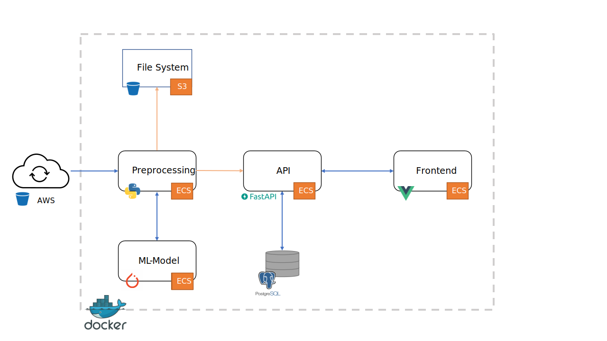
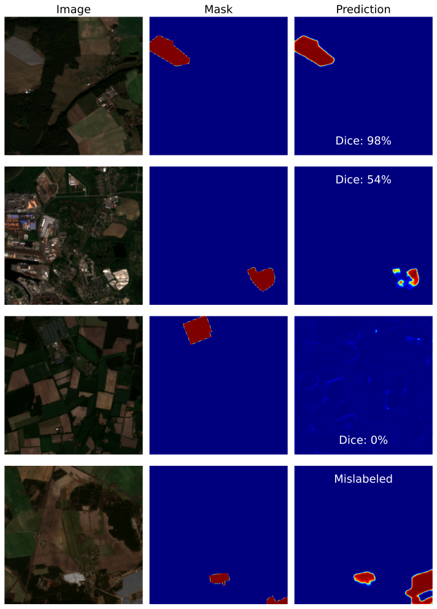

[](https://github.com/Taraman12/Solarpark-detection/actions/workflows/lint.yml)
[](https://github.com/Taraman12/Solarpark-detection/actions/workflows/docker.yml)

<!-- omit from toc -->
# Continous Solar Park Detection 
This tool is designed to deliver automated and continuous data about solar parks in Germany like the exact location, size and first detection.
Which is accomplished by a deep learning model for image segmentation which uses satellite imagery from sentinel-2 which is updated every five days. This tool runs the prediction every month. The predictions can be validated on a website, which delivers the used image as well as a image with a higher resolution from google maps. The data on google Maps gets updated between one to three years, thats why it can only be used as an indication. The tool utilizes a microservice architecture with the following services: DB, API, downloader, preprocessing, Ml-serve, frontend.
This project was developed as part of a master thesis at the chair of Process- and IT-Integration for AI in enterprises at the Julius-Maximilians-University Wuerzburg, Germany. 
<!-- omit from toc -->
## Table of contents:
- [Overview](#overview)
- [Notebooks of interest](#notebooks-of-interest)
- [Installation](#installation)
- [ToDos:](#todos)
- [Pipeline explanation](#pipeline-explanation)
- [Create requirements.txt](#create-requirementstxt)
- [Known problems](#known-problems)
  - [psycopg2:](#psycopg2)

## Overview
The repository is structured as follows:
In Notebooks you can find basics to work with georefeneced data,the development of the ML-Model as well as the function from the other parts of the pipeline.
The src folder contains the folder for each service. At each service is an additional README which gives a deeper look in the functionality of the service.

**The pipeline of the tool looks like this:**  


**Example of the prediction:**  


## Notebooks of interest
Create a custom dataset with masks and Sentinel-2 images:  
[store_patched_dataset_as_tensor.ipynb](Notebooks/preprocessing/store_patched_dataset_as_tensor.ipynb)

Create Train- Val- and Testset:  
[create_train_val_test_split.ipynb](Notebooks/ML_Modell/create_train_val_test_split.ipynb)

Train the model:  
[model_training.ipynb](Notebooks/ML_Modell/model_training.ipynb)

Evaluate the model:  
[evaluate_model_performance.ipynb](Notebooks/ML_Modell/evaluate_model_performance.ipynb)

## Installation
1. Clone the repository
2. Install [poetry](https://python-poetry.org/docs/#installation) (or use pip)
3. Install the dependencies with poetry
```bash
poetry install
```
4. Install the dependencies with pip
```bash
pip install -r requirements-dev.txt
```
5. Rename the .env.example to .env and fill in the variables
6. TBD 

## ToDos:
- [ ] Add a description of the project
- [ ] Add pre-commit hooks
- [ ] Add docformatter again
- [ ] Add mypy again
- [ ] Add readTheDocs
  
## Pipeline explanation


The downloader downloads the Sentinel-2 tiles from Germany and stores them in a unified manner. As of today, there are mainly three sources to retriev Sentinel-2 data. First is through the copernicus api ([*Link*](https://scihub.copernicus.eu/twiki/do/view/SciHubWebPortal/APIHubDescription)). For this data there is no download limit (besides of two streams at the same time), but the data is just online for a couple of month. After that you can trigger an offline retrivial from LTA (second source). There you can retrive all the data since the start of the programm in 2016, but you are limited to one retrivial every 12 hours. The third way is to get the data from Sentinel-on-aws ([*Link*]https://registry.opendata.aws/sentinel-2/). This contains *mostly* all the data since the start on the programm and new data will be added regulary hours after they are published on copernicus hub. The data is in a requester pays bucket. Therefor it costs the transfer rate from aws to retrive this data. However aws creants in the first year 100 GB of data retrival each month.  

The preprocessing merges the different bands (Red, Green, Blue, NIR) into one image and uses a robust normalisation as well as color corecction. At the end the larger image (10980x10980 pixels) will be chopped into smaller images (256x256 pixels) so it can be proceessed by the neural network. In Production mode the image will be send directly to the ml-model for interferiece and the predictions than will be send through the api to the database. If you want to make trainings data. The preprocessing converts the polygons from the trainings polygons to masks on the small images and stores them with the images on the disk instead sending them to the model. 

The API is used as a connection between the the services among them selves (mainly the DB) and as a start hub 


 ## Create requirements.txt
 check if all groups are correct
 
 poetry export -f requirements.txt --output requirements.txt --without-hashes --with main --with lint --with dev --with ml-model --with api

## Known problems

### psycopg2:
sudo apt-get install libpq-dev

mypy vscode settings:
"mypy.dmypyExecutable":".//.env//Lib//site-packages//mypy//dmypy_server.py"
